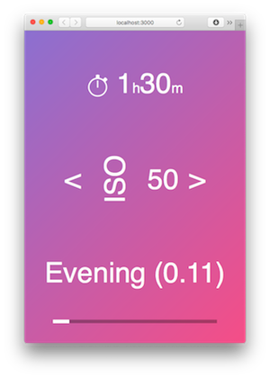

# lightmeter

A simple browser-based light meter widget.



- [Install](#install)
- [Run with web server](#run)
- [Using the LightMeter widget via your own script](#using)
- [Including with browserify](#browserify)
- [Widget API](#api)

<a name="install"></a>
## Install

    1. Clone this repo
    2. npm install

Tested with node.js v0.12.

<a name="run"></a>
## Run with web server

The easiest to use this widget is via the command line and it can run a simple web server serving the UI.

    ./lightmeter [--port <port>]

Visit `http://localhost:<port>` in your browser to view the widget.

The default port is `3000`.

When used in this way, the application code in [static/src/main.js]() is [Browserified](http://browserify.org).

### Supplying data via MQTT

It listens on the MQTT topic `ciot/pinhole/<id>/light/value` where `<id>` is supplied by the environment variable `ID=xxx`.

<a name="using"></a>
## Using the LightMeter widget via your own script

You can specify your own entry point into the LightMeter application on the command line:

    ./lightmeter <entry-script>

For example, if you have a script called `my-script.js` that you want to use the widget on port `12345` then you would run:

    ./lightmeter --port 12345 my-script.js

Your script will be loaded into the browser via Browserify meaning you can use any modules you like. Here's a simple example:

```js
// my-script.js
var LightMeterWidget = require('lightmeter').Widget;
var lightmeter = new LightMeterWidget();
lightmeter.setLightLevel(10);
```

<a name="browserify"></a>
## Including with browserify

You can also require the widget into your own code using Browserify:

    var LightMeterWidget = require('lightmeter').Widget;

<a name="api"></a>
## Widget API

- [<code>new Widget(template, useDefaults)</code>](#api-new)
- [<code>Widget#setLightLevel(value)</code>](#api-setLightLevel)
- [<code>Widget#addLightingCondition(spec)</code>](#api-addLightingCondition-single)
- [<code>Widget#addLightingCondition(specs)</code>](#api-addLightingCondition-many)
- [<code>Defining a lighting condition</code>](#api-define)
- [<code>Widget.defaults</code>](#api-defaults)

<a name="api-new"></a>
### new Widget(template, useDefaults)

| Argument | Type    | Default | Description|
|----------|---------|---------|------------|
| template | string  | `static/ui.tmpl` | An optional string template to use when rendering the widget. If you don't specify this, then the template at [static/ui.tmpl]() is used, which is what you want. |
| useDefaults | boolean | false | A boolean indicating whether to add the default lighting conditions. Set this to try if you want to defaults for a Viddy pinhole camera to be added. You can also find these conditions saved in `Widget.defaults`. |

<a name="api-setLightLevel"></a>
### Widget#setLightLevel(value)

| Argument | Type    | Default | Description|
|----------|---------|---------|------------|
| value    | float   | REQUIRED | A number between 0 and 1 of the light level to be shown on the meter. A value of 0 will show no light and a value of 1 will show maximum light. Setting the light level triggers the UI to refresh. |

<a name="api-addLightingCondition-single"></a>
### Widget#addLightingCondition(spec)

| Argument | Type    | Default | Description|
|----------|---------|---------|------------|
| spec     | object  | REQUIRED | An object describing a lighting condition to be added to the UI. |

<a name="api-addLightingCondition-many"></a>
### Widget#addLightingCondition(specs)

| Argument | Type    | Default | Description|
|----------|---------|---------|------------|
| specs    | array  | REQUIRED | An array of lighting condition objects. |

<a name="api-define"></a>
#### Defining a lighting condition

A lighting condition setting contains the following fields.

| Argument | Type    | Default | Description|
|----------|---------|---------|------------|
| name     | string  | REQUIRED | The name to be shown in the UI |
| exposure | object  | REQUIRED | A mapping of exposure times to ISO values. |
| colour | object  | REQUIRED | Which exposure time should be triggered for each ISO. |
| colour.start | string  | REQUIRED | A CSS colour value for the start of the UI background gradient |
| colour.stop | string  | REQUIRED | A CSS colour value for the end of the UI background gradient |
| sensorRange | array  | REQUIRED | The lighting level that will trigger this condition, the array is structured as `[min, max]` |

Here's a complete example lighting condition:

```js
{
  name: 'Direct sun',
  exposure: {
    400: 1.3,
    800: 1.6,
    200: 2.5,
    100: 5,
    50: 10
  },
  colour: {
    start: '#f7ec86',
    stop : '#fdc753'
  },
  sensorRange: [0.8, 1]
}
```

<a name="api-defaults"></a>
### Widget.defaults

An array containing the defaul set of lighting conditions. You can include this and have a quick, fully-working UI like this:

    lightMeter.addLightingCondition(Widget.defaults);
